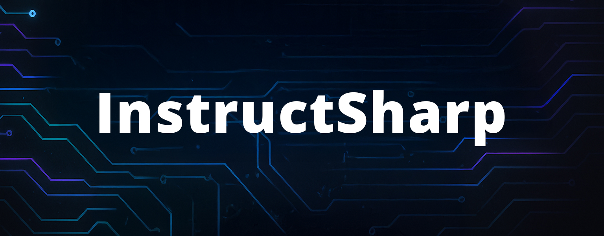

<p align="center">
  <a href="https://www.nuget.org/packages/InstructSharp"></a>
  <a href="https://github.com/jonathanfavorite/InstructSharp/actions"></a>
  <a href="LICENSE"></a>
</p>

---

# InstructSharp

**InstructSharp** is a **high‑performance, provider‑agnostic .NET SDK** that turns **large‑language‑model requests into one‑line calls** and **structured JSON responses**. ✨

*Seamlessly swap between OpenAI ChatGPT, Anthropic Claude, Google Gemini, X.AI Grok, DeepSeek, or Meta LLaMA without rewriting a single line of business logic.*

> **TL;DR** – Install the package, define a POCO, call `QueryAsync<T>()`, get strongly‑typed results. ✅

---

## 📑 Table of Contents

1. [Key Features](#key-features)
2. [Quick Install](#quick-install)
3. [Hello, World](#hello-world)
4. [Provider Matrix](#provider-matrix)
5. [Advanced Usage](#advanced-usage)
6. [Performance Notes](#performance-notes)
7. [Roadmap](#roadmap)
8. [Contributing](#contributing)
9. [License](#license)

---

## Key Features

| 🚀 Feature                  | Description                                                                                   |
| --------------------------- | --------------------------------------------------------------------------------------------- |
| **Multi‑Provider**          | One unified client for **ChatGPT, Claude, Gemini, Grok, DeepSeek, LLaMA** – more coming.      |
| **Strong Typing**           | Pass any C# POCO → receive a `LLMResponse<T>` with fully‑deserialized data.                   |
| **Consistent API**          | Every client exposes `QueryAsync<T>(request)` so swapping vendors is a one‑line change.       |
| **JSON Schema Enforcement** | Automatic schema generation via **NJsonSchema**, keeping responses strict & safe.             |
| **Minimal Setup**           | Install → add API key → ship. Works in console apps, ASP.NET, Azure Functions, Blazor & more. |
| **Full .NET 8 Support**     | Targets **net8.0** but runs on .NET 6/7 via multi‑target NuGet build.                         |
| **Tiny Footprint**          | Zero reflection at runtime, no heavy AI SDKs pulled in. Pure HTTP + `System.Text.Json`.       |

---

## Quick Install

```bash
# Package Manager
Install-Package InstructSharp

# .NET CLI
dotnet add package InstructSharp
```

> ⚡ **Tip** – add `--prerelease` to grab nightly builds from CI.

---

## Hello, World

```csharp
using InstructSharp.Clients.ChatGPT;
using InstructSharp.Core;

class QuestionAnswer
{
    public string Question { get; set; }
    public string Answer   { get; set; }
}

var chat = new ChatGPTClient("YOUR_OPENAI_API_KEY");

var req = new ChatGPTRequest
{
    Model       = ChatGPTModels.GPT4oMini,
    Instruction = "Talk like a pirate.",
    Input       = "What is 2 + 2?"
};

var res = await chat.QueryAsync<QuestionAnswer>(req);
Console.WriteLine($"A• {res.Result.Answer}");
```

Want raw text? Simply use `string` instead of a POCO:

```csharp
var text = await chat.QueryAsync<string>(req);
```

---

## Provider Matrix

| Provider               | Client Class     | Structured JSON        | Streaming   | Docs                                      |
| ---------------------- | ---------------- | ---------------------- | ----------- | ----------------------------------------- |
| OpenAI ChatGPT         | `ChatGPTClient`  | ✅ JSON Schema          | ⏳ (roadmap) | [link](https://platform.openai.com/docs/) |
| Anthropic Claude 3     | `ClaudeClient`   | ✅ Tool Calls           | ⏳           | [link](https://docs.anthropic.com/)       |
| Google Gemini 2.5      | `GeminiClient`   | ✅ `responseJsonSchema` | ⏳           | [link](https://ai.google.dev/)            |
| X.AI Grok 3            | `GrokClient`     | ✅ JSON Schema          | ⏳           | [link](https://platform.x.ai/)            |
| DeepSeek Chat          | `DeepSeekClient` | ✅ JSON Object          | ⏳           | [link](https://deepseek.com/)             |
| Meta LLaMA (DeepInfra) | `LLamaClient`    | ✅ JSON Object          | ⏳           | [link](https://deepinfra.com/)            |

> *Streaming support is on the roadmap – follow the [issues](https://github.com/YOUR_GITHUB_HANDLE/InstructSharp/issues) to vote.*

---

## Advanced Usage

### 🔒 Secure Configuration

```csharp
var http = new HttpClient {
    Timeout = TimeSpan.FromSeconds(15)
};
var chat = new ChatGPTClient(Environment.GetEnvironmentVariable("OPENAI_KEY"), http);
```

* `HttpClient` injection lets you share retry policies, logging handlers, or proxies.
* Add standard headers globally via `DefaultRequestHeaders`.

### 🎛️ Tuning Parameters

Every request type exposes vendor‑specific knobs such as `Temperature`, `TopP`, `MaxTokens`, etc. Set only what you need – defaults are sane.

### 🗂️ Error Handling

```csharp
try
{
    var res = await chat.QueryAsync<MyType>(req);
}
catch(HttpRequestException ex) when (ex.StatusCode == HttpStatusCode.TooManyRequests)
{
    // handle 429 rate limit
}
```

### 📉 Token Usage

`LLMResponse<T>.Usage` returns prompt, response & total tokens. Use it for cost tracking or throttling.

---

## Performance Notes

* **No dynamic** – all JSON is parsed with `System.Text.Json`. Fast.
* **Schema cache** – Generated JSON schemas are cached per‑type to avoid regeneration.
* **One HTTP round‑trip** – no second prompt to "format JSON"; the schema is sent in the first call.

Benchmarks live under `/benchmark` – PRs welcome! 🏎️💨

---

## Roadmap

* [ ] 🔄 Streaming completions
* [ ] 🧩 Function & tool call helpers
* [ ] 🏗️ Automatic retries / exponential back‑off
* [ ] 📝 DocFX site with full API reference
* [ ] 🏆 Benchmarks vs raw vendor SDKs

Have a feature in mind? [Open an issue](https://github.com/YOUR_GITHUB_HANDLE/InstructSharp/issues) or send a PR!

---

## Contributing

1. **Fork** the repo
2. `git clone` & `dotnet build` – tests should pass
3. Create your branch: `git checkout -b feature/my-awesome`
4. Commit & push, then **open a PR**

### Dev Environment

* .NET 8 SDK
* Optional: `direnv` / `dotenv` for API keys
* EditorConfig + Roslyn analyzers enforce style
